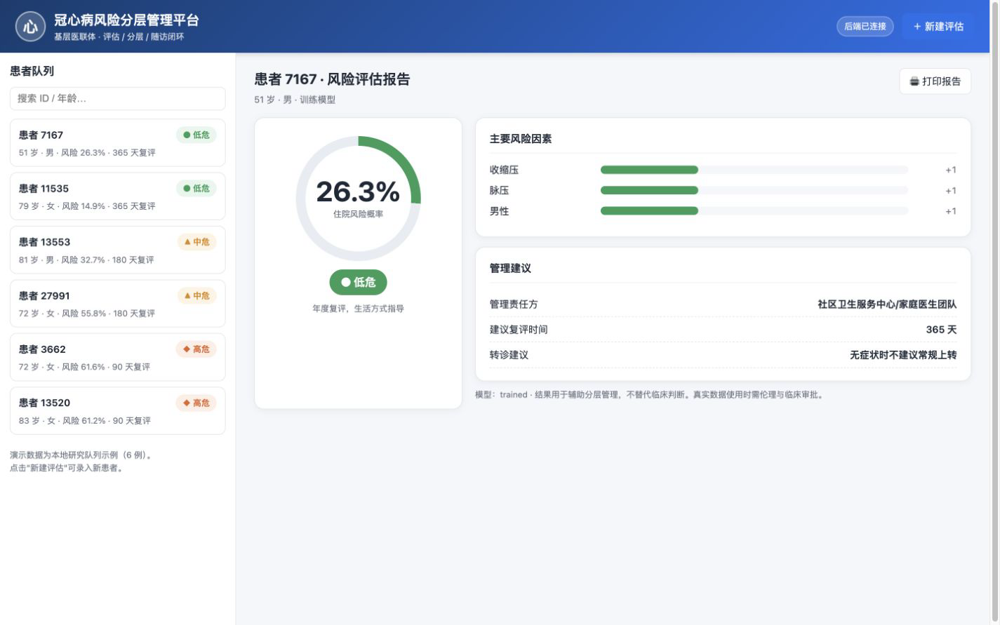
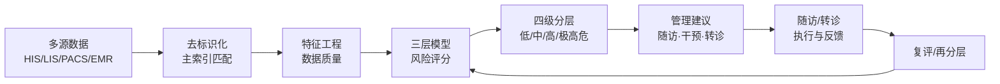
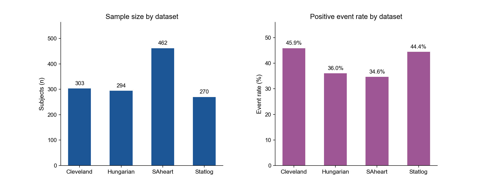
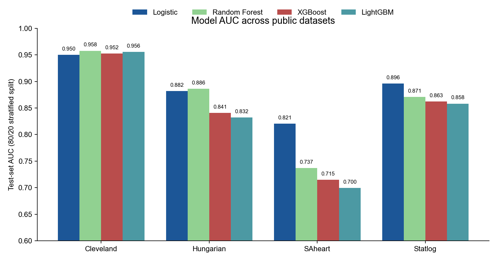
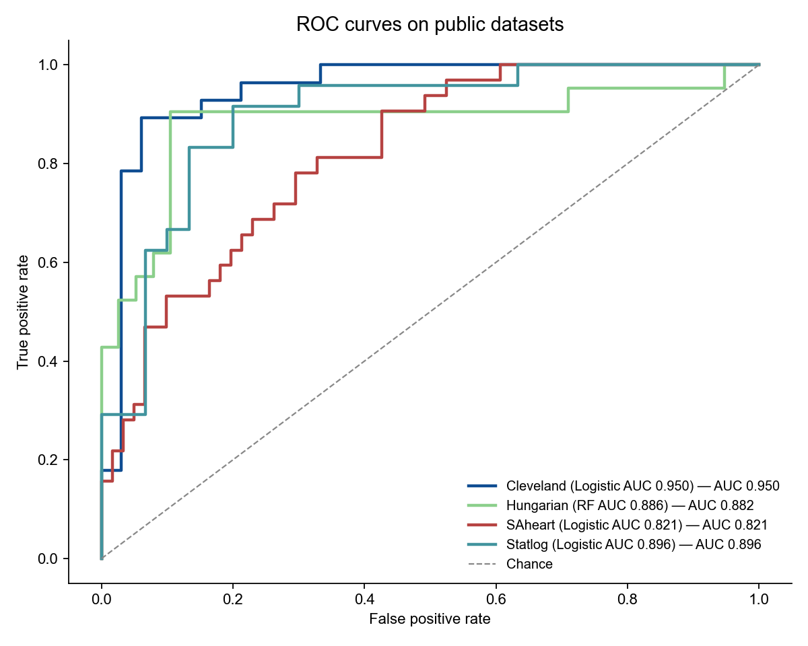
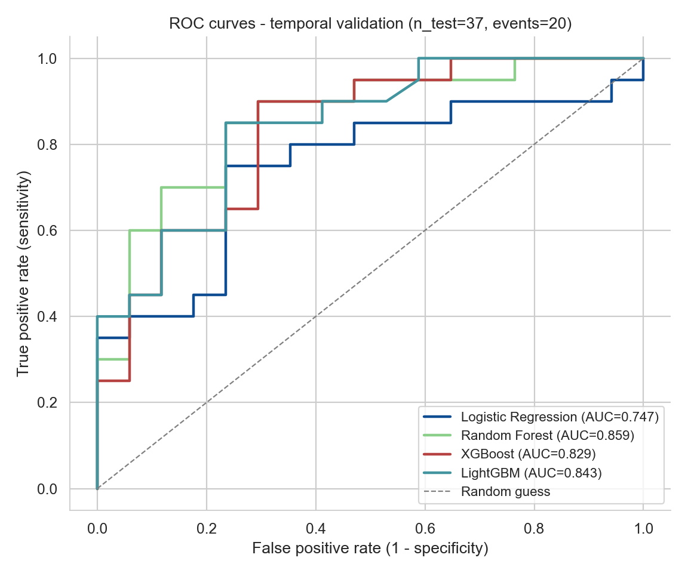
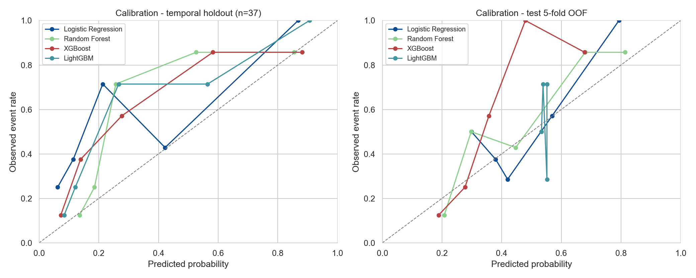
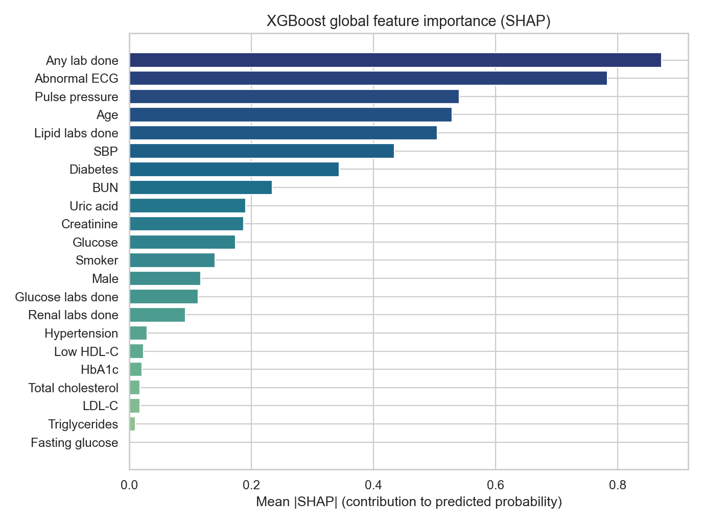
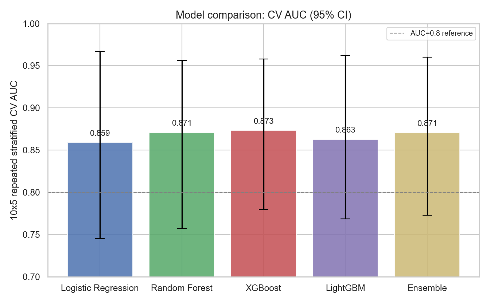

<p align="center">
  
</p>

<p align="center">
  
  
  
  
  
</p>

# 🫀 CHD Risk Stratification

**面向基层医联体的冠心病风险智能评估与闭环管理原型**——把建模设计落地为可运行的工程骨架，
覆盖「**多源数据治理 → 研究队列构建 → 三层模型比较 → 风险解释 → 四级分层管理 → 随访/转诊闭环**」全流程。
仓库不包含真实患者数据，也不包含申报书原文或联系方式。

> ⚠️ 当前代码是**研究和试点工具原型**，不是已验证医疗器械或临床诊断系统。正式使用前必须完成伦理审查、数据脱敏、
> 模型训练、内部/时间外验证、校准、临床专家复核和上线审批。

---


## 💡 项目缘起

冠心病是基层慢病管理中最重要也最复杂的环节之一，而基层医联体长期面临三个现实痛点：

- 🎯 **缺统一工具**：高危人群缺少统一、可复用的风险评估工具；
- 🔗 **评估与随访脱节**：风险评估做完之后与随访管理"两张皮"，各管各的；
- 🗂️ **数据散落**：HIS、LIS、PACS、公卫随访、家庭医生签约等系统数据难以整合成可分析、可建模的形式。

本项目正是针对这些痛点，把申报书里的建模构想，落成一套**可运行、可验证、可闭环**的工程原型。

## 🛠️ 我们怎么做

整体遵循「**数据 → 模型 → 管理**」三层递进的思路：

1. 🧱 **数据治理**：把多源数据治理成一人一行的研究队列，保证每条记录都有清晰的基线、结局与随访窗口；
2. 🧠 **三层模型比较**：底层 China-PAR 临床基准 → 中层 Logistic / Cox 可解释统计模型 → 上层 RF / XGBoost / LightGBM 机器学习模型；
3. 🚦 **闭环管理**：把风险分数翻译成低危 / 中危 / 高危 / 极高危四档管理路径，绑定管理主体、随访周期、干预重点与转诊建议，并用随访反馈驱动复评与再分层。

## 🧠 模型与方法

- 📋 **22 个结构化特征**：人口学、传统危险因素、检验检查、用药与随访管理；
- 🏆 **部署模型 XGBoost**：10×5 重复分层交叉验证 AUC **0.871**，时间外验证 AUC **0.835**；
- ✅ **分层与结局高度一致**（本地 246 例）：低危档实际住院率 **18%**、中危 **74%**、高危 **98%**；
- 🔍 **SHAP 可解释**：每条结果说明风险来源（血压控制不佳、心电图异常、肾功能下降、糖化偏高等），医生看得懂、也讲得清。

## 💻 多端使用

- 🩺 **医生端**：网页界面 / 桌面应用，查看患者队列、发起评估、阅读分层报告与随访建议；
- 📊 **数据人员**：命令行批量评分，一键生成完整性与范围违例质量报告；
- 🔌 **开发者**：HTTP 接口可嵌入现有基层医疗信息系统。

## 🔒 数据与安全

- 🚫 仓库不含真实患者数据、不含申报书原文；
- 🔍 本地真实数据只做聚合统计与可行性审计，不导出患者级记录；
- 🧪 合成数据仅用于流程冒烟测试，明确标注不能作为评估依据；
- 🗄️ 训练模型产物默认不进版本库，避免本地数据特征外泄。

## 📈 当前进展与边界

- ✅ 公共数据集流程验证（UCI 系列，交叉验证 AUC ≈ 0.91，证明流程可复现）；
- ✅ 本地真实数据可行性审计（Stage B，给出字段缺口与导出模板）；
- ✅ 本地数据模型训练与分层验证（Stage C）。
- ⚠️ 以上均为**研究 / 试点原型**，不是认证的医疗器械或临床诊断系统；正式使用前仍需更大样本真实队列、人工复核标签、外部与时间外验证、概率校准、伦理审查与临床专家审批。

## 🚀 未来方向

1. 取得**含检验指标 + 非冠心病对照**的更大规模研究宽表，人工复核文本抽取字段；
2. 补充**决策曲线分析（DCA）**、**NRI / IDI 增量评价**、**Cox 生存分析**；
3. 把评分结果嵌入**随访、复评、转诊、反馈闭环表单**，让基层连续管理真正运转。

## ✨ 核心亮点

| 亮点 | 说明 |
|---|---|
| 🧩 **多源数据接入** | HIS / LIS / PACS / EMR / 公卫随访 / 家庭医生签约 / 慢病管理 / 用药 / 转诊 / 住院结局 |
| 🧠 **三层模型体系** | China-PAR 临床基准层 · Logistic/Cox 可解释统计层 · RF / XGBoost / LightGBM 机器学习层 |
| 📊 **严格评估方法** | 10×5 重复分层交叉验证（含 95% CI）· 时间外验证 · 校准曲线 · Brier · SHAP 解释 |
| 🚦 **四级分层管理** | 低危 / 中危 / 高危 / 极高危，绑定管理主体、随访周期、干预重点与转诊路径 |
| 💻 **多端使用** | 命令行 CLI · HTTP API · 医生网页 UI · 桌面安装版（macOS / Windows） |
| 🔒 **数据安全** | 只处理去标识化数据；合成数据仅用于流程冒烟测试；本地数据与模型产物不进 Git |

## 🔄 闭环工作流



## 📊 项目结果汇总

全部模型验证结果、最优/部署模型与复现命令见 **[docs/results_summary.md](docs/results_summary.md)**（最优部署模型：本地 XGBoost，CV AUC 0.871、时间外 AUC 0.835）。

## 模型能做什么

输入一份患者档案（年龄、性别、血压血脂血糖、吸烟、共病、用药依从性、就诊频次等 **22 个特征**），
即可完成 **「风险评估 → 四级分层 → 随访/转诊建议」** 的闭环流程：

### ① 个体风险评分

传入患者快照，输出**风险概率 + 四级等级 + 主要风险原因 + 管理计划**：

```json
{
  "probability": 0.79,
  "tier": "high",
  "tier_label": "高危",
  "reasons": [
    { "label": "心电图异常", "contribution": 1.55 },
    { "label": "年龄", "contribution": 0.78 },
    { "label": "收缩压", "contribution": 0.60 }
  ],
  "management_plan": {
    "owner": "家庭医生团队+牵头医院专科协同",
    "follow_up_days": 90,
    "actions": ["纳入重点随访", "开展用药规范性核查", "生成专科复核或上转建议"],
    "referral": "建议心血管专科复核"
  }
}
```

### ② 四级风险分层

按风险概率划分为四档，每档绑定**管理主体、随访周期、干预重点与转诊路径**（详见 [四级分层闭环路径](docs/closed_loop_pathway.md)）：

| 等级 | 概率范围 | 管理主体 | 建议随访 |
|---|---:|---|---:|
| 🟢 低危 | < 5% | 社区卫生服务中心 / 家庭医生团队 | 365 天 |
| 🟡 中危 | 5% – 10% | 社区卫生服务中心 / 家庭医生团队 | 180 天 |
| 🟠 高危 | 10% – 20% | 家庭医生团队 + 牵头医院专科协同 | 90 天 |
| 🔴 极高危 | ≥ 20% | 牵头医院心血管专科 + 家庭医生团队 | 30 天 |

> 分层与真实结局高度一致（以本地 246 例验证）：低危档实际住院率 **18%**，中危 **74%**，高危 **98%**。

### ③ 多模型训练与对比

对 Logistic、随机森林、XGBoost、LightGBM **一键训练**，自动完成交叉验证 + 时间外验证，
输出 **AUC / Brier / 灵敏度 / 特异度 / F1 / 校准分箱**，并把最优模型持久化为评分链路可用的模型包。
当前部署模型 **XGBoost**：CV AUC **0.871**（95% CI 0.780–0.958），时间外 AUC **0.835**。

### ④ 风险解释（SHAP）

输出 SHAP 特征重要性，说明该患者的**主要风险来源**（如心电图异常、肾功能、收缩压、糖化血红蛋白），
便于医生向患者解释风险并制定个性化干预方案。

### ⑤ 批量评估与数据质量

支持 CSV 批量评分（自动附加风险概率、等级、随访天数、转诊建议），并输出数据**完整性与范围违例**质量报告，
适合基层健康档案批量筛查。

### ⑥ 多种使用方式

| 方式 | 入口 |
|---|---|
| 命令行 CLI | `score-one` 单例评分 · `score-csv` 批量评分 · `train-tabular` 训练 · `quality-report` 质量报告 |
| HTTP API | `POST /assess` 评估 · `GET /health` 健康检查（`uvicorn chd_risk.api:app`） |
| 网页 UI | `http://127.0.0.1:8765/ui/` 医生端界面（患者列表 / 新建评估 / 分层结果） |
| 桌面版 | macOS `.app` 与 Windows `.exe`（[见桌面版说明](#桌面版desktop-app)） |

### ⑦ 本地数据可行性审计（Stage B）

对医院/社区导出的 HIS/EMR 工作簿做**摸底审计**：只输出聚合统计、字段覆盖与缺口清单，**不导出患者级数据**，
用于快速判断「现有数据能否建模」，并为数据科导出研究宽表提供字段模板。

---

> ⚠️ **边界**：以上是研究和试点工具原型，不是已验证医疗器械或临床诊断系统。合成数据仅用于流程冒烟测试；
> 正式使用前必须完成伦理审查、真实队列训练、内部/时间外验证、校准、临床专家复核和上线审批。

## 建模思路

申报书中的核心方案被整理为以下工程模块：

- 数据来源：HIS、LIS、PACS、EMR、公卫随访、家庭医生签约、慢病管理、用药、转诊和住院结局。
- 队列构建：成年人群，优先覆盖 35 岁及以上和合并冠心病危险因素人群；按个体划分训练/验证/测试集，推荐 70/15/15 或时间外验证。
- 特征体系：人口学与传统危险因素、慢病共病、检验检查、诊疗行为、药物治疗、随访管理六类变量。
- 三层模型：China-PAR 基准层、Logistic/Cox 可解释统计层、随机森林/XGBoost/LightGBM 机器学习层。
- 评价指标：AUC、灵敏度、特异度、F1、校准曲线、Brier score、H-L 检验、DCA、NRI/IDI。
- 临床转化：输出风险等级、主要风险来源和管理建议，并绑定低危/中危/高危/极高危四级路径。

## 仓库结构

```text
.
├── src/chd_risk/          # 风险评估、特征、分层、CLI、API 原型
├── docs/                  # 建模设计、变量字典、闭环路径、数据安全说明
├── examples/              # 单例 JSON 示例
├── data/                  # 合成数据说明，真实数据不要提交
├── tests/                 # stdlib unittest 测试
├── models/                # 本地模型产物目录，不提交真实模型
└── outputs/               # 本地输出目录
```

## 界面预览（UI Preview）

面向医生的 Web 界面：患者队列 → 风险评估（概率 + 四级分层）→ 风险原因 → 管理建议（复评/转诊）。

<p align="center">
  
</p>

启动方式：

```bash
cd /Users/mac/Documents/冠心病风险评估模型/chd-risk-stratification
source .venv/bin/activate
python -m uvicorn chd_risk.api:app --host 127.0.0.1 --port 8765
# 浏览器打开 http://127.0.0.1:8765/
```

> 评估由 `models/trained_model_bundle.joblib` 中的训练模型完成（无模型时回退权重原型）。

## 桌面版（Desktop App）

打包为独立 macOS 应用（pywebview 原生窗口 + 内置 FastAPI 后端 + 训练模型），无需安装 Python 依赖。

**macOS（Apple Silicon）下载**：`release/CHD-Risk-Stratification-macOS-arm64.zip`（解压后把
`CHD Risk Stratification.app` 拖入"应用程序"即可；首次打开如提示"已损坏/无法验证"，在
"系统设置 → 隐私与安全性"中允许，或运行 `xattr -cr /Applications/CHD Risk Stratification.app`）。

**从源码重新构建**：

```bash
./scripts/build_desktop.sh
# 产物：dist/CHD Risk Stratification.app 与 release/CHD-Risk-Stratification-macOS-arm64.zip
```

**Windows 版**：PyInstaller 无法跨平台编译，Windows 的 `.exe` 需在 Windows 上构建，两种方式任选：

1. **GitHub Actions 自动构建（推荐）**：推送到仓库后，在 **Actions → Build Desktop App → Run workflow**（或打 `v*` 标签），
   会自动在 Windows / macOS 云服务器上构建并产出可下载的构建产物（artifacts）。
2. **本机构建**：在 Windows 机器上运行：

   ```bat
   scripts\build_desktop.bat
   ```

   > 说明：模型 bundle（`models/trained_model_bundle.joblib`）因包含本地去标识化数据产物而**不进入 Git**，
   > 因此 CI/他人构建的应用默认使用"权重原型"演示模式；如需打包训练模型，请把该文件放回 `models/` 再构建。

> macOS 安装包：`release/CHD-Risk-Stratification-macOS-arm64.zip`（Apple Silicon）。

## ⚠️ macOS 依赖：libomp（xgboost 需要 OpenMP 运行时）

xgboost 在 macOS 上需要 `libomp.dylib`，否则训练模型加载失败（评分会回退到权重原型）。
本机已把 `libomp.dylib` 放在 `.venv/lib/libomp/`。由于 macOS 只在进程启动时读取 `DYLD_*` 环境变量，
**请用启动脚本运行桌面应用/API**：

```bash
./scripts/run_desktop.sh                 # 桌面应用（自动配置 libomp）
./scripts/run_desktop.sh --no-window     # 仅启动本地 API 服务
```

等价手动方式：

```bash
export DYLD_FALLBACK_LIBRARY_PATH="$PWD/.venv/lib/libomp:/usr/local/lib:/usr/lib"
python desktop.py
```

> 打包版 macOS App 已在构建时用 `install_name_tool` 把 libomp 路径写死（`scripts/build_desktop.sh`），无需环境变量。
> 若 `/assess` 提示"评估失败"，多半是 libomp 未配置；修复后会自动回退到权重原型并给出 `model_source=weighted_prototype`。

## 快速运行
## 快速运行

```bash
PYTHONPATH=src python3 -m chd_risk.cli score-one examples/sample_patient.json
PYTHONPATH=src python3 -m chd_risk.cli generate-synthetic --n 200 --output data/synthetic_patients.csv
PYTHONPATH=src python3 -m chd_risk.cli quality-report data/synthetic_patients.csv --output outputs/quality_report.json
PYTHONPATH=src python3 -m chd_risk.cli train-tabular data/synthetic_patients.csv --output-report outputs/training_report.json
PYTHONPATH=src python3 -m chd_risk.cli score-csv data/synthetic_patients.csv --output outputs/scored_patients.csv
PYTHONPATH=src python3 -m unittest discover -s tests
```

安装为本地包：

```bash
python3 -m venv .venv
source .venv/bin/activate
pip install -e .
chd-risk score-one examples/sample_patient.json
```

完整机器学习环境：

```bash
pip install -e ".[ml,api,dev]"
```

启动 API 原型：

```bash
uvicorn chd_risk.api:app --reload
```

Stage B 本地真实世界数据可行性审计（不会导出患者级数据，只输出聚合统计）：

```bash
python3 scripts/stage_b_local_data_feasibility.py --workbook /path/to/local.xlsx --sheet 冠心病21 --output-dir outputs/stage_b_local_data
```

装好完整机器学习依赖后，可以训练 tabular baseline：

```bash
chd-risk train-tabular data/deidentified_research_table.csv --outcome-col outcome_chd
# 时间外验证式划分（按 index_date 排序，前 85% 训练 / 后 15% 测试）：
chd-risk train-tabular data/deidentified_research_table.csv --outcome-col outcome_chd --split temporal --date-col index_date

# 训练后评分自动使用保存的模型 bundle（无模型时回退权重原型）：
chd-risk score-one examples/sample_patient.json
chd-risk score-csv data/processed/research_table_local.csv --output outputs/scored_patients.csv
```

## Stage B 本地数据可行性评估

Stage B 用于检查本地 HIS/EMR/检查报告导出是否具备建模条件。该模块只输出聚合统计和缺口清单，不提交原始 Excel、患者级记录、病历文本或个体预测结果。

```bash
python3 scripts/stage_b_local_data_feasibility.py \
  --workbook "/path/to/local_real_world_extract.xlsx" \
  --sheet "冠心病21" \
  --output-dir outputs/stage_b_local_data
```

本次本地 Excel 摸底结论见 `docs/stage_b_local_data_feasibility.md`。数据科导出一人一行研究宽表时，可参考 `data/stage_b_research_table_schema.csv`。

## 公共数据集验证

在 4 个公开心血管数据集上跑同一套「训练 → 评估 → 校准 → SHAP → 报告」流水线，验证流程可复现（不依赖任何本地私有数据）。完整报告见 `docs/stage_public_datasets_validation.md`。

| 数据集 | 样本 | 阳性率 | 最优模型 | 测试集 AUC |
|---|---:|---:|---|---:|
| UCI Heart Disease (Cleveland) | 303 | 45.9% | random_forest | 0.958 |
| UCI Statlog (Heart) | 270 | 44.4% | logistic_regression | 0.896 |
| UCI Heart Disease (Hungarian) | 294 | 36.0% | random_forest | 0.886 |
| ESL South African Heart Disease (SAheart) | 462 | 34.6% | logistic_regression | 0.821 |

数据文件位于 `data/public/`（`uci_cleveland.data`、`statlog_heart.dat`、`hungarian_heart.data`、`SAheart.data`）。复现命令：

```bash
python scripts/stage_public_multi_validation.py --output-dir outputs/stage_public
```

> ⚠️ 这些是流水线复现性/基准检查，不是临床验证；各库人群、特征与结局定义不同，跨库 AUC 不能横向比较「临床水平」。

## 当前实现边界

- `src/chd_risk/china_par.py` 是 China-PAR 适配边界。因申报书没有提供正式系数，仓库只放了开发用 proxy，不能当成真实 China-PAR 公式。
- `src/chd_risk/model.py` 是透明权重模型，用于跑通软件流程。真实项目应替换为本地队列训练和校准后的模型。
- `data/` 只允许放合成数据或脱敏后的结构模板，真实患者级数据不应提交到 GitHub。
- `scripts/stage_b_local_data_feasibility.py` 只是本地真实世界数据可行性审计，不会训练模型，也不代表临床验证完成。

## 重要提醒：合成数据仅用于流程冒烟测试

`data/synthetic_patients.csv` 的 `outcome_chd` 标签由原型模型自身概率生成，属于循环论证，
**在其上训练得到的任何 AUC/指标都没有评估意义**。它只用于验证训练-评估-报告软件流程。
真实建模必须使用去标识化的本地研究宽表（见 `data/stage_b_research_table_schema.csv`）。

## 当前进度（2026-08-04 更新）

已完成：

- ✅ **评分链路已接入训练模型**：`train-tabular` 默认把最优模型保存为 `models/trained_model_bundle.joblib`；`score-one`/`score-csv`/API 自动加载它（无模型时回退到权重原型）。分层阈值按训练人群分数分位数标定（相对风险带），缺失值不进入"风险原因"。
- ✅ Stage A：UCI 公开数据验证（`scripts/stage_a_uci_validation.py`，Cleveland 303 例，4 模型 CV AUC ~0.91，证明训练-评估-报告流水线可复现），见 `docs/stage_a_uci_validation.md`。
- ✅ 公共数据集多库验证（`scripts/stage_public_multi_validation.py`，Cleveland 303 / Statlog 270 / Hungarian 294 / SAheart 462 例，4 模型 AUC 0.82-0.96），见 `docs/stage_public_datasets_validation.md`。
- ✅ 本地 Stage B 可行性审计（`scripts/stage_b_local_data_feasibility.py`，输出聚合统计，不导出患者级数据）。
- ✅ 本地研究宽表构建 ETL（`scripts/build_research_table.py` → `data/processed/research_table_local.csv`，提取规则见 `docs/research_table_extraction.md`）。
- ✅ 多模型训练与验证报告（Logistic / 随机森林 / XGBoost / LightGBM，随机划分 + 时间外划分，AUC/Brier/灵敏度/特异度/F1/校准分箱/SHAP 解释），见 `docs/stage_c_local_model_exploration.md`。

尚待完成：

- 数据科按 `data/stage_b_research_table_schema.csv` 导出含 LIS 检验、结构化血压/血脂/血糖、**非 CHD 对照**的更大规模研究宽表。
- 文本提取规则 ≥5% 人工抽样复核。
- DCA、NRI/IDI、Cox 生存分析、校准曲线图。
- 将评分结果嵌入随访、复评、转诊和反馈闭环表单。
- 伦理审查、临床专家复核与上线审批。


## 模型报告图

以下为本地研究队列（246 例，结局：是否住院）训练 XGBoost 部署模型的报告图，以及 4 个公共数据集的验证图，按报告出现顺序编号（图1～图9）。仅用于展示，不代表临床验证结论。


*图1：本地研究队列人群基线特征（性别、年龄等分布）*



*图2：公共数据集样本量与阳性事件率*



*图3：4 个数据集 × 4 个模型的测试集 AUC*



*图4：各数据集 ROC 曲线（Logistic 或最优模型）*



*图5：本地模型时间外验证 ROC 曲线（XGBoost 时间外 AUC 0.835）*



*图6：本地模型校准曲线（预测概率 vs 实际发生率）*



*图7：SHAP 特征重要性排序（主要风险来源解释）*



*图8：多模型性能对比（CV AUC 与时间外 AUC）*


*图9：四级风险分层（低危/中危/高危相对风险带）*

> 说明：这些图基于本地示例研究宽表生成，仅用于验证训练-评估-报告软件流程；
> 正式结论需以去标识化、经伦理审查和临床复核的真实队列为准。
