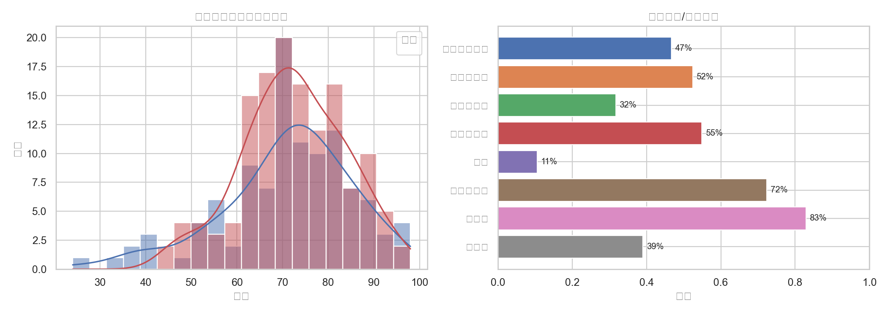
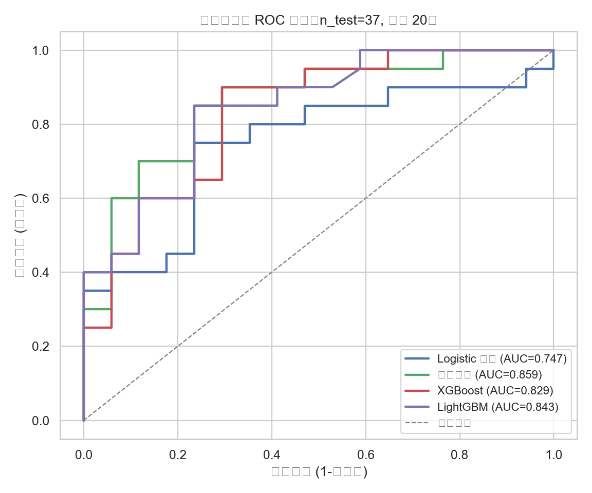
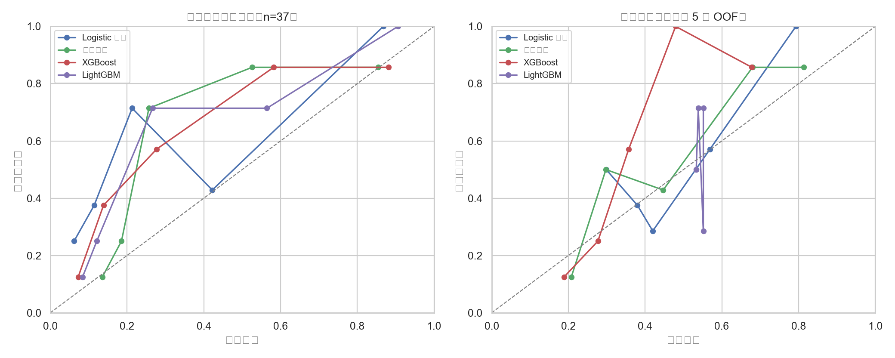
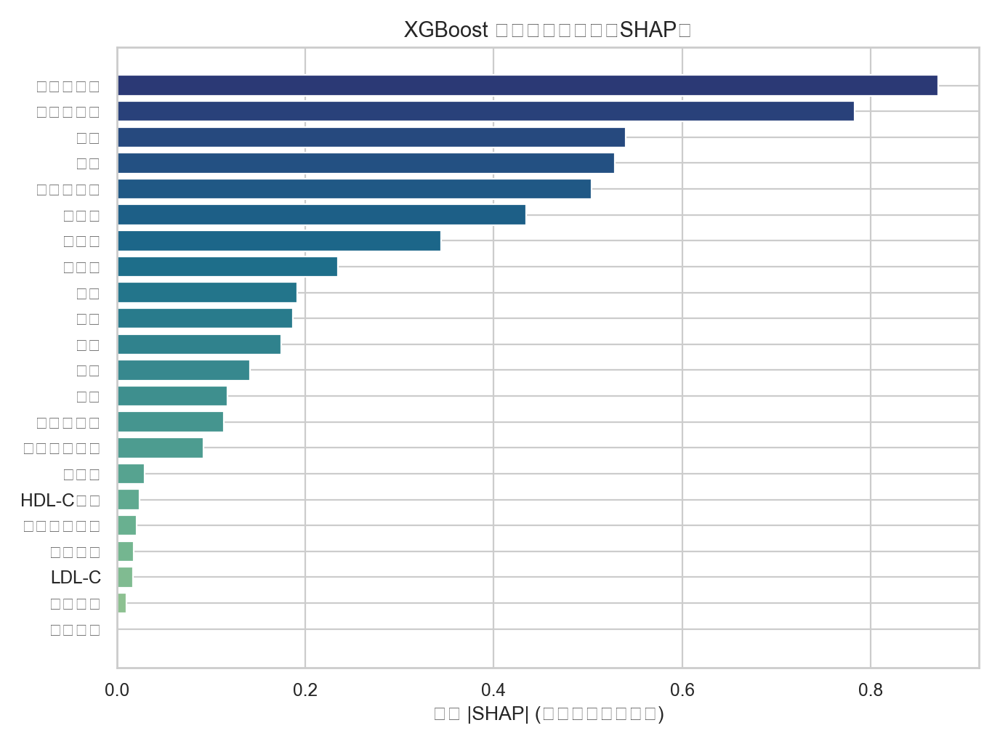
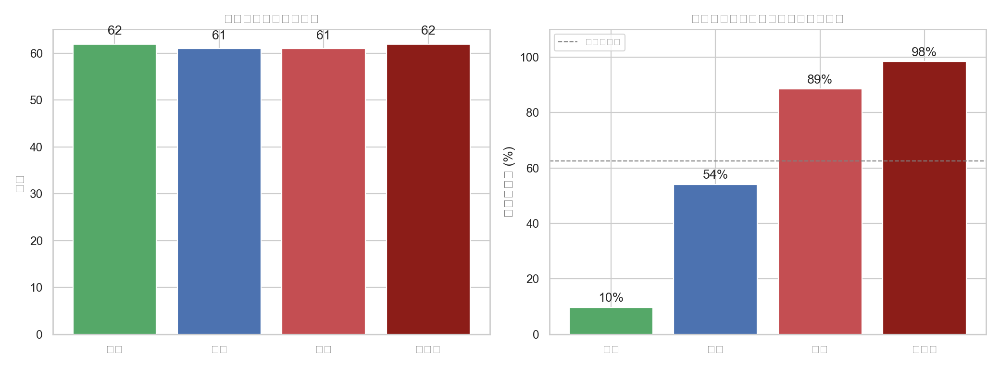

# CHD Risk Stratification

面向基层医联体的冠心病风险智能评估与闭环管理原型仓库。

本仓库根据申报书中的建模设计整理为可运行的工程骨架，覆盖“多源数据治理、研究队列构建、三层模型比较、风险解释、四级分层管理、随访与转诊闭环”。仓库不包含真实患者数据，也不包含申报书原文或联系方式。

> 当前代码是研究和试点工具原型，不是已验证医疗器械或临床诊断系统。正式使用前必须完成伦理审查、数据脱敏、模型训练、内部/时间外验证、校准、临床专家复核和上线审批。

## 建模思路

申报书中的核心方案被整理为以下工程模块：

- 数据来源：HIS、LIS、PACS、EMR、公卫随访、家庭医生签约、慢病管理、用药、转诊和住院结局。
- 队列构建：成年人群，优先覆盖 35 岁及以上和合并冠心病危险因素人群；按个体划分训练/验证/测试集，推荐 70/15/15 或时间外验证。
- 特征体系：人口学与传统危险因素、慢病共病、检验检查、诊疗行为、药物治疗、随访管理六类变量。
- 三层模型：China-PAR 基准层、Logistic/Cox 可解释统计层、随机森林/XGBoost/LightGBM 机器学习层。
- 评价指标：AUC、灵敏度、特异度、F1、校准曲线、Brier score、H-L 检验、DCA、NRI/IDI。
- 临床转化：输出风险等级、主要风险来源和管理建议，并绑定低危/中危/高危/极高危四级路径。

## 仓库结构

```text
.
├── src/chd_risk/          # 风险评估、特征、分层、CLI、API 原型
├── docs/                  # 建模设计、变量字典、闭环路径、数据安全说明
├── examples/              # 单例 JSON 示例
├── data/                  # 合成数据说明，真实数据不要提交
├── tests/                 # stdlib unittest 测试
├── models/                # 本地模型产物目录，不提交真实模型
└── outputs/               # 本地输出目录
```

## 快速运行

```bash
PYTHONPATH=src python3 -m chd_risk.cli score-one examples/sample_patient.json
PYTHONPATH=src python3 -m chd_risk.cli generate-synthetic --n 200 --output data/synthetic_patients.csv
PYTHONPATH=src python3 -m chd_risk.cli quality-report data/synthetic_patients.csv --output outputs/quality_report.json
PYTHONPATH=src python3 -m chd_risk.cli train-tabular data/synthetic_patients.csv --output-report outputs/training_report.json
PYTHONPATH=src python3 -m chd_risk.cli score-csv data/synthetic_patients.csv --output outputs/scored_patients.csv
PYTHONPATH=src python3 -m unittest discover -s tests
```

安装为本地包：

```bash
python3 -m venv .venv
source .venv/bin/activate
pip install -e .
chd-risk score-one examples/sample_patient.json
```

完整机器学习环境：

```bash
pip install -e ".[ml,api,dev]"
```

启动 API 原型：

```bash
uvicorn chd_risk.api:app --reload
```

Stage B 本地真实世界数据可行性审计（不会导出患者级数据，只输出聚合统计）：

```bash
python3 scripts/stage_b_local_data_feasibility.py --workbook /path/to/local.xlsx --sheet 冠心病21 --output-dir outputs/stage_b_local_data
```

装好完整机器学习依赖后，可以训练 tabular baseline：

```bash
chd-risk train-tabular data/deidentified_research_table.csv --outcome-col outcome_chd
# 时间外验证式划分（按 index_date 排序，前 85% 训练 / 后 15% 测试）：
chd-risk train-tabular data/deidentified_research_table.csv --outcome-col outcome_chd --split temporal --date-col index_date

# 训练后评分自动使用保存的模型 bundle（无模型时回退权重原型）：
chd-risk score-one examples/sample_patient.json
chd-risk score-csv data/processed/research_table_local.csv --output outputs/scored_patients.csv
```

## Stage B 本地数据可行性评估

Stage B 用于检查本地 HIS/EMR/检查报告导出是否具备建模条件。该模块只输出聚合统计和缺口清单，不提交原始 Excel、患者级记录、病历文本或个体预测结果。

```bash
python3 scripts/stage_b_local_data_feasibility.py \
  --workbook "/path/to/local_real_world_extract.xlsx" \
  --sheet "冠心病21" \
  --output-dir outputs/stage_b_local_data
```

本次本地 Excel 摸底结论见 `docs/stage_b_local_data_feasibility.md`。数据科导出一人一行研究宽表时，可参考 `data/stage_b_research_table_schema.csv`。

## 当前实现边界

- `src/chd_risk/china_par.py` 是 China-PAR 适配边界。因申报书没有提供正式系数，仓库只放了开发用 proxy，不能当成真实 China-PAR 公式。
- `src/chd_risk/model.py` 是透明权重模型，用于跑通软件流程。真实项目应替换为本地队列训练和校准后的模型。
- `data/` 只允许放合成数据或脱敏后的结构模板，真实患者级数据不应提交到 GitHub。
- `scripts/stage_b_local_data_feasibility.py` 只是本地真实世界数据可行性审计，不会训练模型，也不代表临床验证完成。

## 重要提醒：合成数据仅用于流程冒烟测试

`data/synthetic_patients.csv` 的 `outcome_chd` 标签由原型模型自身概率生成，属于循环论证，
**在其上训练得到的任何 AUC/指标都没有评估意义**。它只用于验证训练-评估-报告软件流程。
真实建模必须使用去标识化的本地研究宽表（见 `data/stage_b_research_table_schema.csv`）。

## 当前进度（2026-08-04 更新）

已完成：

- ✅ **评分链路已接入训练模型**：`train-tabular` 默认把最优模型保存为 `models/trained_model_bundle.joblib`；`score-one`/`score-csv`/API 自动加载它（无模型时回退到权重原型）。分层阈值按训练人群分数分位数标定（相对风险带），缺失值不进入"风险原因"。
- ✅ Stage A：UCI 公开数据验证（`scripts/stage_a_uci_validation.py`，Cleveland 303 例，4 模型 CV AUC ~0.91，证明训练-评估-报告流水线可复现），见 `docs/stage_a_uci_validation.md`。
- ✅ 本地 Stage B 可行性审计（`scripts/stage_b_local_data_feasibility.py`，输出聚合统计，不导出患者级数据）。
- ✅ 本地研究宽表构建 ETL（`scripts/build_research_table.py` → `data/processed/research_table_local.csv`，提取规则见 `docs/research_table_extraction.md`）。
- ✅ 多模型训练与验证报告（Logistic / 随机森林 / XGBoost / LightGBM，随机划分 + 时间外划分，AUC/Brier/灵敏度/特异度/F1/校准分箱/SHAP 解释），见 `docs/stage_c_local_model_exploration.md`。

尚待完成：

- 数据科按 `data/stage_b_research_table_schema.csv` 导出含 LIS 检验、结构化血压/血脂/血糖、**非 CHD 对照**的更大规模研究宽表。
- 文本提取规则 ≥5% 人工抽样复核。
- DCA、NRI/IDI、Cox 生存分析、校准曲线图。
- 将评分结果嵌入随访、复评、转诊和反馈闭环表单。
- 伦理审查、临床专家复核与上线审批。


## 模型报告图

以下图为本地研究宽表（246 例，结局：是否住院）训练 XGBoost 部署模型时生成的报告图，
用于展示队列、模型表现与风险解释流程。仅用于展示，不代表临床验证结论。



*图1：队列人群基线特征（性别、年龄等分布）*



*图2：时间外验证 ROC 曲线（XGBoost 时间外 AUC 0.835）*



*图3：校准曲线（预测概率 vs 实际发生率）*



*图4：SHAP 特征重要性排序（主要风险来源解释）*



*图5：四级风险分层（分数分位数档位：低危/中危/高危/极高危）*


*图6：多模型性能对比（CV AUC 与时间外 AUC）*

> 说明：这些图基于本地示例研究宽表生成，仅用于验证训练-评估-报告软件流程；
> 正式结论需以去标识化、经伦理审查和临床复核的真实队列为准。
