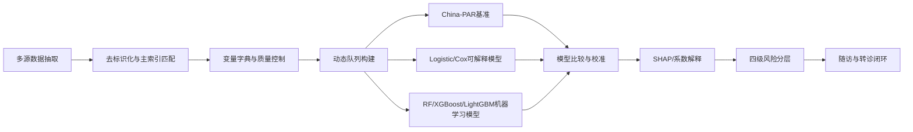

# 建模设计

## 目标

构建适用于基层医联体场景的冠心病风险智能评估与闭环管理原型，将风险评估从一次性分数输出推进到“评估、预警、干预、随访、反馈”的连续管理流程。

## 总体技术路线

## 数据来源

- HIS：门诊、急诊、住院诊疗记录。
- LIS：血脂、血糖、肾功能、炎症指标等检验结果。
- PACS/报告：心电图、颈动脉超声、心脏彩超等检查结论。
- EMR：现病史、既往史、诊断和医嘱。
- 公卫随访：慢病管理、健康档案、随访记录。
- 家庭医生签约：签约状态、团队、服务记录。
- 用药记录：降压、降脂、降糖、抗血小板等药物类别和连续性。
- 转诊和反馈：转诊建议、执行状态、专科反馈、下一次管理时间。

## 队列设计

纳入标准：

- 医联体覆盖范围内成年常住居民或签约居民。
- 至少存在一次诊疗、体检、检验或公卫随访记录。
- 具备年龄、性别、血压、血脂、糖尿病状态等核心变量中的部分信息。
- 能通过唯一 ID 关联至少一个后续随访时间点或结局事件信息。

排除标准：

- 身份无法可靠匹配。
- 核心变量严重缺失且无法合理处理。
- 数据存在明显逻辑错误且无法追溯修正。
- 用于一级预防发病预测时，基线已明确诊断冠心病者不进入发病风险队列，可进入二级预防和闭环管理评价队列。

## 特征工程

特征分为三类：

- 静态特征：基线人口学、传统危险因素、既往病史。
- 动态特征：血压、血脂、血糖、症状频次、用药依从性等随时间变化趋势。
- 管理过程特征：随访中断、用药连续性、转诊执行、反馈闭环。

缺失值处理原则：

- 低缺失率连续变量：中位数或分组中位数插补。
- 中高缺失率变量：保留“是否检测/是否记录”信息特征。
- 关键变量严重缺失：记录剔除原因，必要时排除。
- 所有处理步骤写入建模报告，保持可追溯。

## 三层模型策略

第一层：基线对照模型

- 使用 China-PAR 或本地再校准版本作为临床解释基准。
- 当前仓库仅保留适配接口和开发 proxy，不提供正式临床公式。

第二层：可解释统计模型

- Logistic 回归用于固定时间窗事件风险。
- Cox 比例风险模型用于随访时间充分时的生存分析。
- 输出 OR/HR、95% CI、方向和强度，便于专家复核。

第三层：机器学习模型

- 随机森林、XGBoost、LightGBM 用于多变量非线性关系。
- 调参重点：树深、学习率、正则化、类别不平衡、校准。
- 通过特征重要性和 SHAP 解释个体风险来源。

## 模型评价

- 区分度：AUC、灵敏度、特异度、F1。
- 校准度：校准曲线、Brier score、H-L 检验。
- 临床实用性：决策曲线分析 DCA。
- 增量价值：相对 China-PAR 的 NRI、IDI。
- 泛化评估：优先时间外验证，其次随机训练/验证/测试划分。

## 输出转化

模型输出必须转换为基层可执行信息：

- 风险等级：低危、中危、高危、极高危。
- 风险原因：主要贡献因素，如 LDL-C 升高、收缩压控制不佳、糖尿病合并、胸痛就诊记录、他汀用药不连续、随访中断。
- 管理建议：复评时间、随访频率、健康教育重点、用药规范化建议、转诊建议和反馈要求。

